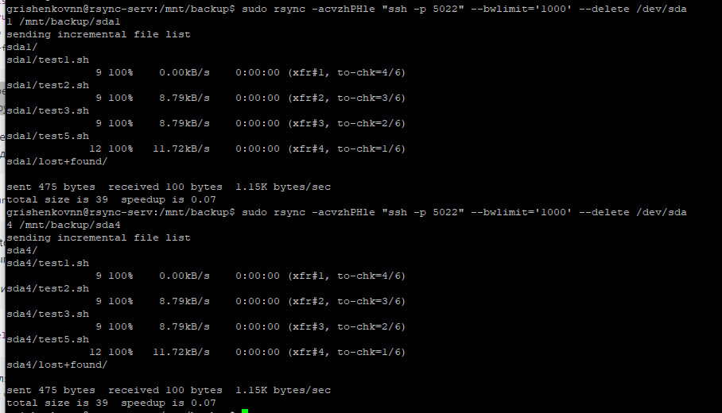

# Домашнее задание к занятию 10.6 «Disaster recovery»


### Инструкция по выполнению домашнего задания

1. Сделайте fork [репозитория c Шаблоном решения](https://github.com/netology-code/sys-pattern-homework) к себе в Github и переименуйте его по названию или номеру занятия, например, https://github.com/имя-вашего-репозитория/gitlab-hw или https://github.com/имя-вашего-репозитория/8-03-hw).
2. Выполните клонирование данного репозитория к себе на ПК с помощью команды `git clone`.
3. Выполните домашнее задание и заполните у себя локально этот файл README.md:
   - впишите вверху название занятия и вашу фамилию и имя
   - в каждом задании добавьте решение в требуемом виде (текст/код/скриншоты/ссылка)
   - для корректного добавления скриншотов воспользуйтесь инструкцией ["Как вставить скриншот в шаблон с решением"](https://github.com/netology-code/sys-pattern-homework/blob/main/screen-instruction.md)
   - при оформлении используйте возможности языка разметки md (коротко об этом можно посмотреть в [инструкции по MarkDown](https://github.com/netology-code/sys-pattern-homework/blob/main/md-instruction.md))
4. После завершения работы над домашним заданием сделайте коммит (`git commit -m "comment"`) и отправьте его на Github (`git push origin`);
5. Для проверки домашнего задания преподавателем в личном кабинете прикрепите и отправьте ссылку на решение в виде md-файла в вашем Github.
6. Любые вопросы по выполнению заданий спрашивайте в чате учебной группы и/или в разделе “Вопросы по заданию” в личном кабинете.

Желаем успехов в выполнении домашнего задания!

---

### Задание 1

В чём разница между DRaaS, BaaS, Active-Active, Active-Passive?

*Приведите ответ в свободной форме.*

Ответ:

DRaaS (Disaster Recovery as a Service) и BaaS (Backup as a Service) являются различными способами защиты данных, используемыми компаниями.

DRaaS предоставляет возможность быстрой восстановления бизнес-приложений и данных в случае аварии или катастрофы. Это достигается путем репликации данных на удаленный сервер, который может использоваться для восстановления приложений и данных в случае отказа основной инфраструктуры. DRaaS обычно применяется в паре с Active-Passive (активный-пассивный) конфигурацией, где имеется резервная копия базы данных, которая используется только в случае сбоя основной базы данных.

BaaS, с другой стороны, предоставляет возможность создавать резервные копии данных и хранить их в облаке. Это делает возможным быстрое восстановление данных в случае потери или повреждения данных. BaaS используется для защиты данных, содержащихся на серверах, на рабочих станциях пользователей, на мобильных устройствах и в других местах.

Active-Active (активный-активный) и Active-Passive (активный-пассивный) - это две конфигурации высокой доступности, используемые для обеспечения непрерывности работы бизнес-приложений. 

В Active-Active конфигурации приложение реплицируется на несколько серверов, которые могут использоваться параллельно для обработки запросов пользователей. 

В Active-Passive конфигурации, как уже упоминалось, имеется резервная копия базы данных, которая будет запущена в случае сбоя основной базы данных.

---

### Задание 2

Компании нужно составить план восстановления в случае Disaster recovery. Сервер состоит из системного диска и диска с данными. 
Требуется копировать два логических диска на один физический: 
- системный диск (C:) (20 гигабайт);
- диск с данными (D:) (256 гигабайт). 

В требованиях говорится: 
- данные критичны в течение 24 часов после аварии;
- сеть критична к большим потокам данных в рабочее время;
- рабочее время с 9.00 до 18.00, пять дней (понедельник – пятница);
- план резервирования должен быть реализован для диска C и для диска D. В случае Linux-систем /dev/sda1, /dev/sda4 или /dev/sdb1-данные;
- считается, что для этой задачи может быть: 1) поставлен второй сервер или 2) выбрана облачная инфраструктура с определённой услугой;
- компания готова платить за 10 терабайт места как в одном, так и в другом случае.
 
*Приведите ответ в форме плана востановления с выбранным механизмом и получившейся топологией.*

Ответ:

Для реализации плана восстановления после аварии, рекомендуется использовать облачную инфраструктуру с услугой Disaster Recovery as a Service (DRaaS).

Топология системы будет следующей:
Основной сервер с системным диском C: и диском данных D:.
Резервный сервер, на который будут реплицироваться данные с основного сервера.

План восстановления:
+ Настроить автоматическую репликацию всех данных, хранящихся на диске C: и диске D: с основного сервера на резервный сервер с помощью DRaaS.
+ При возникновении аварии на основном сервере, переключить все запросы на резервный сервер.
+ После устранения причины аварии на основном сервере, восстановить репликацию данных с резервного сервера на основной сервер.
+ В конце рабочего дня выполнить полную репликацию всех данных на резервный сервер.
+ Периодически проверять работоспособность резервного сервера для подтверждения его готовности к использованию в случае аварии.

Данный план восстановления гарантирует быстрое восстановление доступа к данным в течение 24 часов и минимизирует потери данных в случае аварии. Выбор облачной инфраструктуры с услугой DRaaS позволит компании не только сохранить данные на удаленном сервере, но и сократить затраты на обслуживание серверов и снизить риски возникновения отказов в работе информационной системы.

---

# Задания со звёздочкой*

Эти задания дополнительные. Их выполнять не обязательно. На зачёт это не повлияет. Вы можете их выполнить, если хотите глубже разобраться в материале.
 

### Задание 3*

Используя программу R-sync, составьте конфигурацию для выполнения прошлой задачи.

*Пришлите файл конфигурации.*

Ответ:

Исходил из расчета, что облако берется в Yandex Cloud. В данном примере создается две секции: backup-sda1 и backup-sda4, которые отвечают за соответствующий раздел. Для каждой секции указывается настройки пути, комментария, пользователя и группы, а также устанавливаются параметры чтения/записи, игнорирования ошибок, исключение папки lost+found.

Содержимое файла rsync.conf

```
# Общие настройки
max connections = 5
timeout = 300

# Настройки для /dev/sda1
[backup-sda1]
path = /mnt/backup/sda1/
comment = "Backup for /dev/sda1"
uid = root
gid = root
read only = false
use chroot = true
ignore errors = true
exclude = lost+found/

# Настройки для /dev/sda4
[backup-sda4]
path = /mnt/backup/sda4/
comment = "Backup for /dev/sda4"
uid = root
gid = root
read only = false
use chroot = true
ignore errors = true
exclude = lost+found/
```

Команды для занесения в crontab 

```
#Полный бэкап
sudo rsync -acvzhPHle "ssh -p 5022" --bwlimit=’1000’ --delete root@<IP_адрес_экземпляра_в_Yandex_Cloud>:/dev/sda1  /mnt/backup/sda1
sudo rsync -acvzhPHle "ssh -p 5022" --bwlimit=’1000’ --delete root@<IP_адрес_экземпляра_в_Yandex_Cloud>:/dev/sda4  /mnt/backup/sda4

#Инкрементальный бэкап
sudo rsync -avzhPHle "ssh -p 5022" --bwlimit=’1000’ --backup --backup-dir=/mnt/backup/sda1/`date "+%Y-%m-%d_%T"` root@<IP_адрес_экземпляра_в_Yandex_Cloud>:/dev/sda1 /mnt/backup/sda1
sudo rsync -avzhPHle "ssh -p 5022" --bwlimit=’1000’ --backup --backup-dir=/mnt/backup/sda4/`date "+%Y-%m-%d_%T"` root@<IP_адрес_экземпляра_в_Yandex_Cloud>:/dev/sda1 /mnt/backup/sda4
```

Ниже скриншот запуска на самом сервере.




